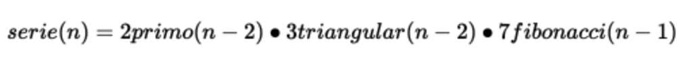

<!-- PROJECT LOGO -->
<br />
<p align="center">

  <h3 align="center">Sngular Interview</h3>

  <p align="center">
    This project validates a given function by Sngular.
  </p>
 
</p>


<!-- TABLE OF CONTENTS -->
<details open="open">
  <summary>Table of Contents</summary>
  <ol>
    <li>
      <a href="#about-the-project">About The Project</a>
      <ul>
        <li><a href="#built-with">Built With</a></li>
      </ul>
    </li>
    <li>
      <a href="#getting-started">Getting Started</a>
      <ul>
        <li><a href="#prerequisites">Prerequisites</a></li>
        <li><a href="#installation">Installation</a></li>
      </ul>
    </li>
    <li><a href="#test">Test</a></li>
    <li><a href="#usage">Usage</a></li>
    <li><a href="#deploy">Deployment</a></li>
    <li><a href="#folder-organization">Folder Organization</a></li>
  </ol>
</details>

<!-- ABOUT THE PROJECT -->
## About The Project 🤔

This project is a Sngular Interview that runs the function above and return the result, everything in different components

 

### Built With 🧰

* [Node v16.16.0](https://nodejs.org/en/)


<!-- GETTING STARTED -->
## Getting Started 🚀

You can run this project with npm start. It will expose the server on port 3000.

In the project directory, you can run:

### `npm start`


### Prerequisites ✔️

* You need to install node on your machine. Follow [node documentation](https://nodejs.org/en/)

* Environment variables required
  - PORT: Have 3000 port free for usage of this project

### Installation 💻

Steps to run app

1. Clone the repo
   
```sh
   git clone https://github.com/alandanielmh/sngular_interview.git
```
   
2. Run npm install on the repo for dependencies

### `npm install`

    
3. Run
    
```sh
    npm start

    or

    npm run build ( for production environment )
```
    

<!-- USAGE EXAMPLES -->
## Usage 🏃

Pending...

## Test ✅

1. Run
    
```sh
    npm test
```

## Deploy:flying_saucer:

Pending...

<!-- FOLDER ORGANIZATION -->
## Folder Organization 📁

- src: source folder tha contains every component
- helpers: Helper functions in Javascript
- hooks: custom hook used
- components: Visual Components
- images: images used in app
- test: Unitest made


Make with ❤️ by Me